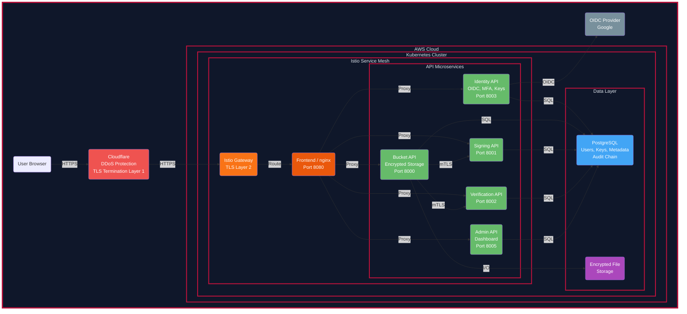

# Ross Mckechnie - Tunnel Bucket v2.0

This project is a demo for a zero trust file transfer service. Users are able to upload, sign and download files with cryptographic evidence under a zero trust architecture. Users can sign up through OIDC (OpenID Connect) with google and enable MFA for further security. Services communicate using mTLS in a service mesh managed by Istio and SPIFFE. FastAPI serves the APIs with hardening, providing protection against common API attacks. The project is run on AWS using Kubernetes to manage Dockerfiles. GitHub Actions control the CI/CD pipeline providing SAST and DAST as well as automated deployments to EC2.

[Demo Site](https://api.rossmck.dev/)

## TECH STACK

- Python (FastAPI, PyTest)
- Istio
- Docker
- Kubernetes
- Terraform
- PostgreSQL
- Argon2id
- OpenID Connect
- TOTP MFA

## Key Concepts

- Zero Trust
- Cryptography
- Infrastructure as Code
- Security Automation & Testing
- Secrets Management 
- CI/CD Security 
- Vulnerability Management & SBOM

## DATA FLOW DIAGRAM

## Code snippets

[API Code](code-snippets/API.md)
[Docker Code](code-snippets/DOCKER.md)
[GitHub Code](code-snippets/GITHUB.md)
[Istio Code](code-snippets/ISTIO.md)
[Terraform Code](code-snippets/TERRAFORM.md)
